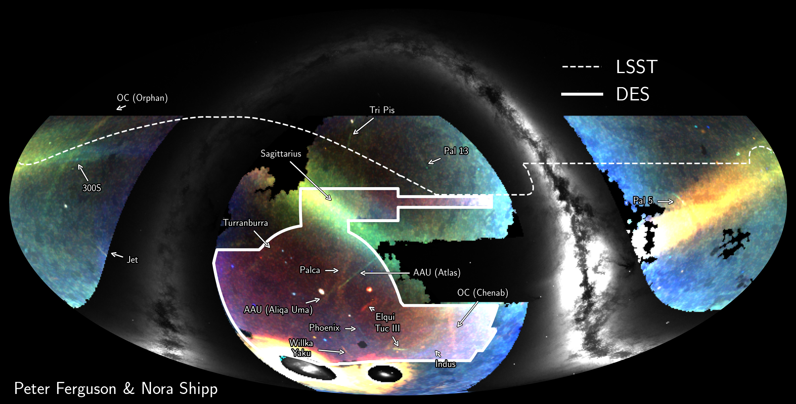
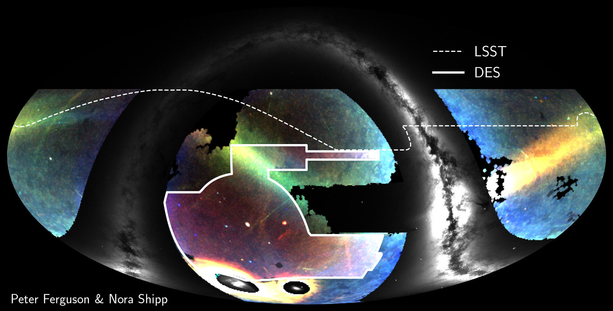
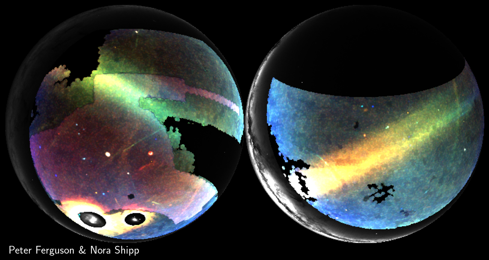

# The DECam Field of Streams: a deep view of the Milky Way halo

The notebook [plot_field_of_streams.ipynb](https://github.com/psferguson/decam_fos/blob/main/notebooks/plot_field_of_streams.ipynb) shows how to create your own field of streams plot in whatever projection you want. 

Pre rendered version can be found in the `plots` directory

## With annotations

## No annotations

## orthographic projection

